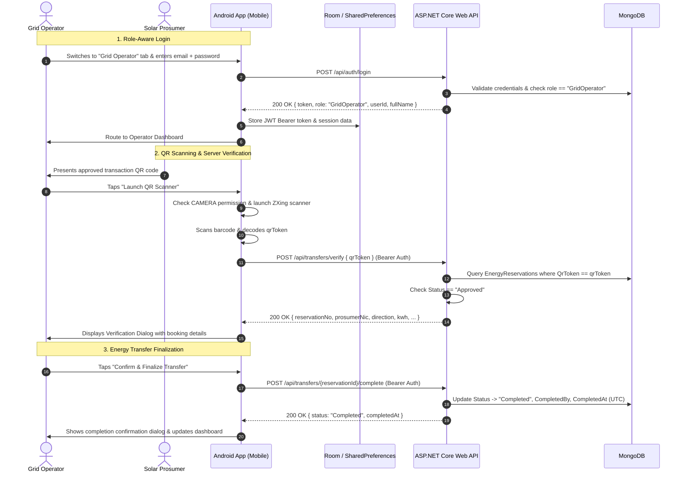

# Grid Operator Mode — Feature Documentation

**Feature Ticket:** KAN-22 / KAN-29  
**Branch:** `damith-KAN-22`  
**System Components:** Pure Native Android Application (`SmartSolarMicrogridMobile`) & ASP.NET Core Web API (`SmartSolarMicrogridAPI`)  
**Date:** September 2026  

---

## 1. Executive Summary

Grid Operator Mode provides operational staff with real-time station management capabilities on both the backend API and the native Android mobile application. It enables Grid Operators to:
1. Authenticate through a dedicated staff login path against the centralized Web API (`/api/auth/login`).
2. Scan dynamic Prosumer transaction QR codes at charging/drop-off station bays using the smartphone's camera.
3. Validate reservation details against server records in real time (`/api/transfers/verify`).
4. Finalize the energy transfer job, recording the completion state and audit timestamp in MongoDB (`/api/transfers/{reservationId}/complete`).

---

## 2. End-to-End Architecture & Workflow



---

## 3. Backend Implementation (`SmartSolarMicrogridAPI`)

### 3.1 Endpoints
* **`POST /api/auth/login`**: Authenticates users (Prosumers, Operators, Backoffice) and returns a signed JWT token containing the user's `ClaimTypes.NameIdentifier` and `ClaimTypes.Role`.
* **`POST /api/transfers/verify`**:
  * **Authorization:** `[Authorize(Roles = "GridOperator,Backoffice")]`
  * **Payload:** `VerifyQrRequestDto { QrToken }`
  * **Logic:** Finds the reservation matching `QrToken`. Ensures status is `Approved`. Throws `NotFoundException` if token does not exist, or `BusinessRuleException` if the reservation was already completed, cancelled, or rejected.
  * **Response:** Returns `QrVerificationResponseDto` with full booking metadata.
* **`POST /api/transfers/{reservationId}/complete`**:
  * **Authorization:** `[Authorize(Roles = "GridOperator,Backoffice")]`
  * **Logic:** Retrieves reservation by MongoDB `_id`, verifies `Approved` state, marks `Status = "Completed"`, stamps `CompletedBy = operatorId` (extracted securely from JWT claims) and `CompletedAt = DateTime.UtcNow`.
  * **Response:** Returns `TransferCompleteResponseDto`.

### 3.2 Key Backend Files
| File Path | Description |
|---|---|
| `Controllers/TransferController.cs` | Controller exposing `/verify` and `/{reservationId}/complete` with role authorization. |
| `Services/Interfaces/ITransferService.cs` | Contract interface for transfer verification and finalization. |
| `Services/TransferService.cs` | Core business logic, status verification, and MongoDB updates. |
| `DTOs/Requests/VerifyQrRequestDto.cs` | Request payload containing `QrToken`. |
| `DTOs/Responses/QrVerificationResponseDto.cs` | Response payload containing verified booking information. |
| `DTOs/Responses/TransferCompleteResponseDto.cs` | Response payload confirming finalization. |
| `Configuration/DependencyInjectionExtensions.cs` | Registered `IMongoRepository<EnergyReservation>` and `ITransferService`. |

---

## 4. Mobile Application Implementation (`SmartSolarMicrogridMobile`)

### 4.1 Networking & Architecture Layer
* **Retrofit 2.11 & OkHttp 4.12**:
  * `ApiClient.kt`: Configured singleton with an `AuthInterceptor` that dynamically attaches `Authorization: Bearer <token>` to all authenticated requests and a logging interceptor for network tracing.
  * `ApiService.kt`: Retrofit definitions for `/api/auth/login`, `/api/transfers/verify`, and `/api/transfers/{id}/complete`.
  * `data/api/models/`: Standardized models (`ApiResponse<T>`, `LoginRequestDto`, `AuthResponseDto`, `VerifyQrRequestDto`, `QrVerificationResponseDto`, `TransferCompleteResponseDto`).
  * `SessionManager.kt`: Encapsulates `SharedPreferences` for token storage, operator identity, role, and custom server base URL.

### 4.2 Role-Aware Login Flow
* **Layout (`activity_prosumer_login.xml`)**:
  * Features a Material 3 toggle group (`Solar Prosumer` vs. `Grid Operator`).
  * **Solar Prosumer mode**: Displays NIC & Password fields, registration link, and authenticates via local SQLite Room database.
  * **Grid Operator mode**: Dynamically transitions to Staff Email & Password fields, hides registration link, and authenticates against the central Web API.
  * **Server Settings Button**: Opens `dialog_server_settings.xml` allowing developers and operators to easily customize the base URL (e.g. `http://10.0.2.2:5014/` for Android emulator or LAN IP for physical testing).
* **Controller (`ProsumerLoginActivity.kt` & `ProsumerLoginViewModel.kt`)**:
  * Validates inputs and handles asynchronous loading, success routing, and error feedback.
  * Successfully authenticated operators are routed directly to `OperatorDashboardActivity`.

### 4.3 Operator Dashboard
* **Layout (`activity_operator_dashboard.xml`)**:
  * Operator profile banner with name, email, and "GRID OPERATOR" role badge.
  * Operational guidelines checklist for station staff.
  * Primary hero card with a prominent "Launch QR Scanner" button.
  * Logout action in the app bar that clears stored JWT credentials.
* **Activity (`OperatorDashboardActivity.kt`)**:
  * Enforces active session checks on startup.
  * Manages camera runtime permissions (`Manifest.permission.CAMERA`) with user explanations.
  * Launches the ZXing barcode scanner contract with portrait orientation lock.

### 4.4 QR Scanning, Verification & Finalization Dialog
* **Layout (`dialog_verify_transfer.xml`)**:
  * **Loading State**: Displays spinner and status message during server verification.
  * **Verified State**: Formatted transaction card showing:
    * Reservation Number (e.g., `RES-2026-0042`)
    * Prosumer NIC
    * Direction badge (`Drop-off` / `Charge`)
    * Energy Volume (`XX.X kWh`)
    * Scheduled Time Window
    * Station Code
    * Status badge (`APPROVED`)
  * **Finalization Button**: "Confirm & Finalize Transfer" invokes the completion API.
  * **Completion State**: Displays confirmation receipt with UTC timestamp and updates dashboard audit log.
  * **Error State**: Displays detailed server message if the QR code is invalid, expired, or previously completed.
* **ViewModel (`OperatorViewModel.kt`)**:
  * Utilizes Kotlin Coroutines (`viewModelScope`) and LiveData (`VerifyState`, `CompleteState`) to manage network calls and error parsing.

---

## 5. Android Build Compatibility & Configuration

To ensure seamless execution in Android Studio and on emulators/devices:
* **Android Gradle Plugin (AGP):** Configured to `8.8.1` in `gradle/libs.versions.toml`.
* **Compile & Target SDK:** Configured to `35` (Android 15) in `app/build.gradle.kts`.
* **AndroidX & Material Dependencies:** Aligned with stable versions compatible with AGP 8.8.1 (`material 1.12.0`, `appcompat 1.7.0`, `activity 1.9.3`, `core-ktx 1.15.0`).
* **Permissions in `AndroidManifest.xml`:**
  * `<uses-permission android:name="android.permission.INTERNET" />`
  * `<uses-permission android:name="android.permission.CAMERA" />`
  * `android:usesCleartextTraffic="true"` (for local HTTP development).

---

## 6. Testing & Demonstration Guide

### Step 1: Start the Web API
Ensure the ASP.NET Core API is running:
```powershell
cd d:\Projects\EADproject-Y4S1\SmartSolarMicrogridAPI
dotnet run --launch-profile http
```
The API serves at `http://localhost:5014`.

### Step 2: Launch the Android Mobile App
In Android Studio:
1. Select the `Medium Phone API 35` emulator.
2. Click **Run ▶** (or run `.\gradlew.bat assembleDebug` and install the APK via `adb`).

### Step 3: Test Grid Operator Login
1. On the login screen, select the **Grid Operator** tab.
2. If testing on an emulator, the default Base URL `http://10.0.2.2:5014/` is automatically used.
3. Enter operator credentials (e.g., `operator@microgrid.com` / `Password123!`).
4. Tap **Sign In** -> Observe navigation to the Grid Operator Dashboard.

### Step 4: Test QR Scanning & Finalization
1. On the dashboard, tap **Launch QR Scanner**.
2. Grant camera permission when prompted.
3. Scan a valid prosumer booking QR code.
4. Review the verification card details.
5. Tap **Confirm & Finalize Transfer** -> Observe the success confirmation state and database update to `Completed`.
